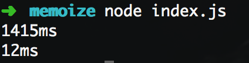

# memoize

Simple demonstration on memoization in JavaScript.

Heavily inspired by Daniel Brain's [medium post](https://medium.com/@bluepnume/async-javascript-is-much-more-fun-when-you-spend-less-time-thinking-about-control-flow-8580ce9f73fc).

## How to run

```shell
node index.js
```



Running the code will calculate the Fibonacci number of `123456`, repeat this calculation `10000` times, and pop out the run-time in milliseconds.

The first number represents the un-memoized call, with the second being the memoized call.

## What is memoization?

I'll borrow this great definition from Divyanshu Maithani's [article](https://medium.freecodecamp.org/understanding-memoize-in-javascript-51d07d19430e):

_> **Memoization** is an optimization technique used primarily to speed up computer programs by **storing the results of expensive function calls** and returning the cached result when the same inputs occur again._

In other words, memoization is a way to store results into a cache and retrieve those cached results.

The benefit becomes obvious as function calls get more expensive -

## Memoization function

```javascript
let memoize = function(method) {
  let cache = {};

  return async function() {
    let args = JSON.stringify(arguments);
    cache[args] = cache[args] || method.apply(this, arguments);
    return cache[args];
  };
};
```

This function turns any function into a memoized one.

If the memoized function is called twice with the same arguments, it will return the same cached value the 2nd time.

It's important to note that **the promise is being cached, and not the final value.**
